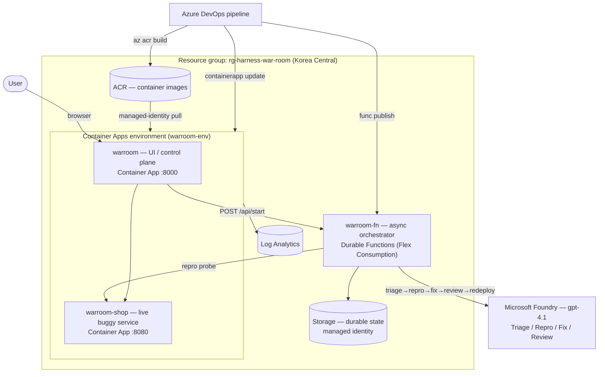

# ⚡ Harness War Room

A multi-agent app where **Triage → Repro → Fix → Review** agents pick up a customer
incident and collaborate live to turn it into a real code diff backed by a passing
test — the **harness loop running visibly on screen**. The agents act on a *live
buggy service*, reproduce the defect over HTTP, fix it, and only hand off once tests
go green. The bigger ticket needs two Fix→Review loops before it passes.

**Live UI:** https://warroom.jollymoss-1476338c.koreacentral.azurecontainerapps.io
**Repo:** github.com/jaehoonch/harness-war-room · **CI/CD:** Azure DevOps → ACR → Azure Container Apps + Durable Functions (`rg-harness-war-room`, Korea Central).

---

## What it is

War Room turns an incident into a verified fix using four specialized agents and a
deterministic supervisor:

- **Supervisor** (plain code, no LLM) enforces **test-gated handoffs** and re-loops
  Fix→Review until tests pass or `max_loops` is reached.
- **Agents** (Microsoft Agent Framework on Microsoft Foundry, `gpt-4.1` via managed
  identity): Triage locates the file, Repro writes the failing test, Fix patches it,
  Review issues a PASS/FAIL verdict and guardrail check.
- **shop-api** is the **live "problematic application"** — it imports the same
  `demo_repo` source, so a defect on disk overcharges a real `/price` `/tax`
  `/loyalty` call. Repro is a real HTTP probe; redeploy after the fix flips it green.
- **Sandbox**: no-network, copy-on-run subprocess pytest scoped to the ticket's test.
- **AG-UI** events stream over SSE into a vanilla-JS timeline + chat.

Two run modes: an **async production run** on Azure Durable Functions (real repro,
real ADO branch/PR, real redeploy), and a `DEMO_MODE=1` replay for offline demos.

## Scenario

A billing incident lands in the queue: a P1 overcharge bug in the storefront. War
Room takes the ask and drives it end to end:

1. **Triage** classifies the incident and points at the offending file.
2. **Repro** calls the live `shop-api`, observes the overcharge, and writes a failing pytest.
3. **Fix** produces the minimal patch; the **Sandbox** runs the test.
4. **Review** gives PASS/FAIL — the P1 needs two Fix→Review loops to go green.
5. On green, the run opens an ADO branch/PR and triggers the pipeline that redeploys
   `shop-api`; the same probe now returns the correct price.

## Architecture



| Azure resource | Role |
|----------------|------|
| Container App `warroom` | UI / control plane (FastAPI :8000, AG-UI over SSE) |
| Container App `warroom-shop` | Live buggy storefront the agents repro/fix against (:8080) |
| Durable Functions `warroom-fn` | Async orchestrator (HTTP starter → durable loop), Flex Consumption + managed-identity storage |
| Storage account | Durable Functions state (key-less, identity auth — Azure Policy blocks shared keys) |
| Azure Container Registry | App + shop images; identity-based `AcrPull`, no admin creds |
| Microsoft Foundry (`gpt-4.1`) | The four agents, called via managed identity (no API key) |
| Log Analytics | Container Apps logs |
| Azure DevOps pipeline | Test → ACR build → ACA deploy → durable publish |

## How it fits the hackathon's *Evaluation* category

War Room **is** evaluation-driven: every agent handoff is gated by an automated
verdict, not vibes.

- **Test-gated handoffs** — the Supervisor runs pytest in the sandbox between steps;
  an agent only advances when the evaluation passes.
- **Review agent as judge** — a stronger model issues a PASS/FAIL + guardrail check;
  failures re-loop Fix→Review automatically (the P1 takes two loops).
- **Live-system verification** — Repro probes the real `shop-api`; redeploy is only
  trusted once the same probe flips green, so the eval closes against production.
- **Reproducible scoring** — `DEMO_MODE` replay and seam-injected adapters make runs
  deterministic and offline-testable, so results are measurable, not anecdotal.

The loop demonstrates the category's core idea: the system measures its own output
and refuses to ship until the evaluation is green.

## Run locally

```bash
python -m venv .venv && .venv/Scripts/pip install -r requirements.txt
DEMO_MODE=1 python -m uvicorn app:app --app-dir backend --port 8088
# open http://127.0.0.1:8088
```

`DEMO_MODE=1` replays a recorded run (no Azure). For live agents set
`AZURE_OPENAI_ENDPOINT` (+ managed identity, or `AZURE_OPENAI_API_KEY`) and
`SHOP_API_URL`; for the async runtime set `DURABLE_BASE_URL`.

## Test

```bash
pytest backend/tests -q
```

See `docs/` for the glossary and ADRs. Built with GitHub Copilot harness skills.
